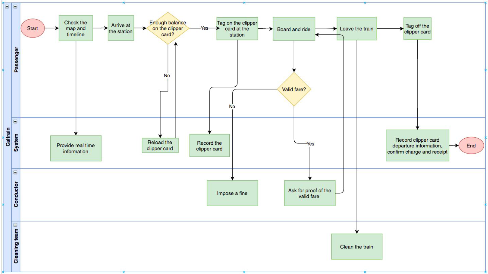
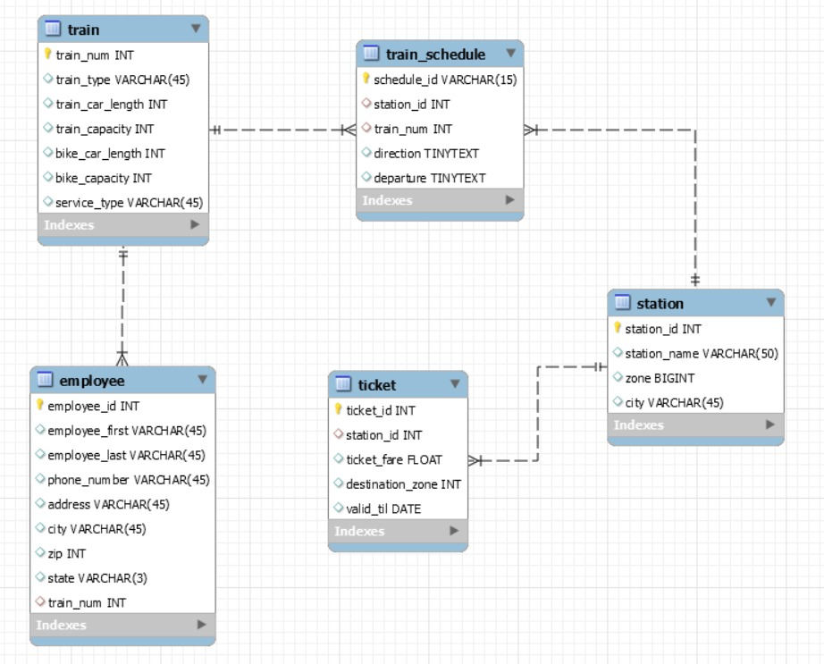
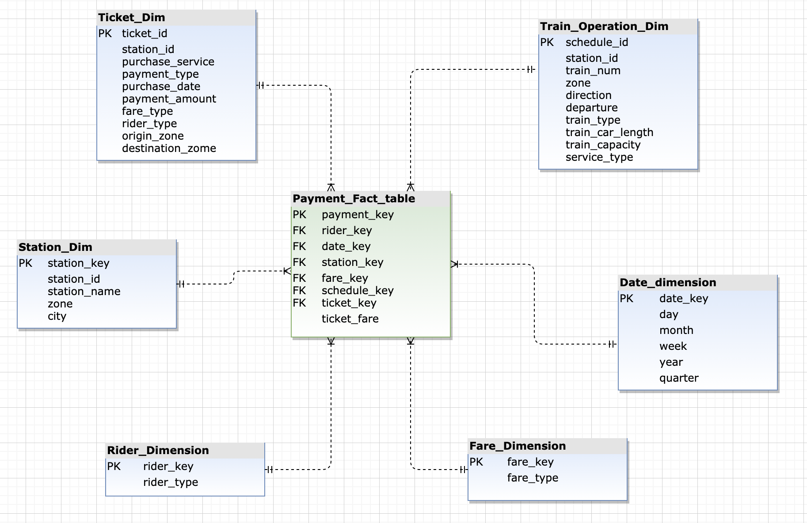

# Caltrain-DataWarehouse
Business Intelligence and Data Warehousing Project to analyze Caltrain Ridership in the Bay Area

## Project Summary
### Problem Statement
Caltrain is one of the busiest commuter rail systems in the San Francisco Bay Area and demand for its service is growing. Caltrain already provides a convenient and cost-effective alternative to driving, connecting passengers' jobs and housing in San Francisco, San Mateo, and Santa Clara counties. In 20 years, the Bay Area’s population is expected to grow by more than 40%, adding 2.4 million residents and 1.3 million jobs. The management team can better prepare itself for the COVID pandemic and make better business decisions using this analysis.
### Solution
The Caltrain IT Operations team has created a data warehouse to import data sources provided by Caltrain Business Plan. Our first dashboard provides lag measures, which show the payment trend as well as the average ticket count of fare types. The second dashboard shows the lead measures, it presents the information of payment vs fare type, city, and payment type. The last two dashboards provide information about the passenger segmentation overpayment amount by rider type, locations, and direction, as well as the forecast of total payment, and prediction of total payment with and without discounts.
### Technical Overview
Data warehouse implementation is done by designing a star schema with one fact table and some conformed dimensions. MySQL database is used for on-premise data injection. The Fare Dimension table has been implemented as Slowly Changing Dimension Type 2. Pentaho has been used to extract, transform, and load data. We used Tableau to create the dashboards to better visualize the business process. There are 4 phases in this project.
They are:
1. Business Analysis
2. Data Modeling
3. ETL Implementation
4. Tableau Implementation

# Phase 1: Business Analysis
In this phase, we identified the business needs and provided solutions to business problems. The solutions consist of process improvement, strategic planning to incur profits, and growth of the organization. The Business Scenario includes the details of Caltrain Business, the process and operation flow of the business, swim lane diagram, lead measures, lad measures, and Analytical use cases (Descriptive and Predictive Analysis).
### Key Information
Stakeholders: John (passenger), the conductor, the cleaning team
Service: Cal train experience
Infrastructure : Clipper card machine, Computer/Phone, Ticket Scanner, Cleaning tools
Additional Information: Cal train stations
Timeline: Arrived at 4 PM and left at 4:30 PM

### Swim Lane Diagram

### Analytical Measures
#### Lead Measures:
1. The most popular fare types per quarter (over payment amount)
2. The most popular cities per quarter
3. The most popular payment type per quarter
4. Average ticket orders per day.
5. Highest payment amount for the fare type – which fare type that brought the most total payment
#### Lag Measures:
1. Finding payment amount generated for a quarter/year.
2. Average of ticket orders and payment amount per year.
3. Rider type differentiation based on the number of ticket counts – Adult, Disables, Medicare, Senior and Youth.

### Descriptive Analysis:
1. What time and day are busiest and why?
2. What events cause spikes? (holidays, Christmas, etc.)
3. Rider type age distribution
4. Which are the most popular cities?
5. Revenue generated by the top 5 locations
### Predictive Analysis:
1. Revenue forecast for the upcoming days.
2. Payment and ticket count forecast for the next 2 quarters.
3. The total revenue that can be generated with or without the discount?
4. What procedures are they doing to cope with the COVID pandemic?

# Phase 2: Data Modeling

### OLTP Schema Design
OLTP systems record business interactions as they occur in the day-to-day operation of the organization. This OLTP schema is designed to have the below tables: Employee, Train, Train_Schedule, Station, Ticket

### OLAP Schema Design
Data warehouse tables: This will be the main Fact & Dimension tables. This Schema will help in planning and problem-solving.

# Phase 3: ETL Implementation
Data Sources used for implementation
1. MySQL Database
2. CSV
3. Text File
4. Excel

### Data Sets
A portion of the live data provided by Caltrain Business Authorities (https://www.caltrain.com/main.html) We also used mockaroo.com to manually create employee
and ticket data.
#### Part 1: Extract data from data sources to OLTP schema
Order of generating data in tables in the OLTP schema, caltrain.
Table creation for caltrain schema in below order:
1. Employee
2. Station
3. Train
4. Ticket
5. Train Schedule
#### ETL Transformations for caltrain schema
Data Source 1: Load data into employee table from employee data csv file. Split the name field from the data source and load as first name and last name into the employee table.
